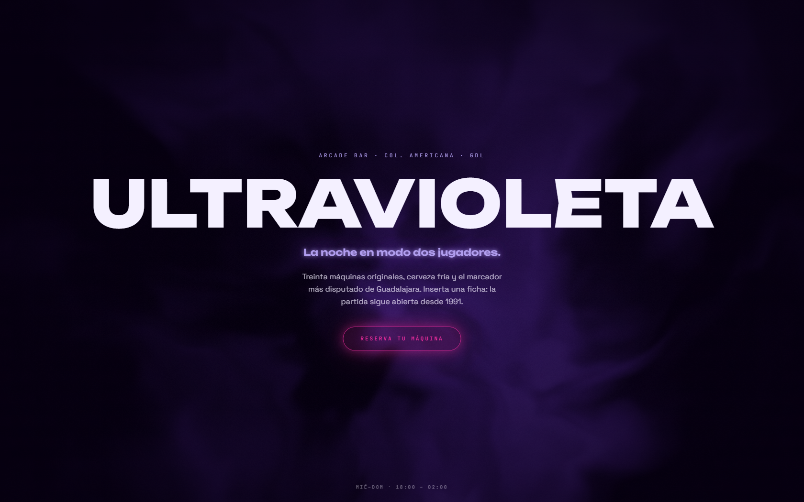

# ULTRAVIOLETA — Arcade bar · La noche en modo dos jugadores


Landing de un arcade bar ficticio en la Colonia Americana. Es la **primera página
de la serie construida con React** — y a propósito no lleva ni una línea de GSAP:
todo el movimiento sale de Motion, de shaders GLSL propios y de patrones del
catálogo React Bits.

| Hero | Sección |
| --- | --- |
|  |  |

## El vocabulario de animación

- **Seda violeta por shader** — el fondo del hero es un fragment shader con
  *domain warping* (fBm deformando fBm) corriendo en un `<Canvas>` de React Three
  Fiber. El chunk de three.js viaja aparte (`lazy` + `Suspense`): el hero pinta al
  instante sobre basalto y la seda aparece al estar lista. Grano fino inyectado en
  el shader para romper el banding de los gradientes oscuros.
- **Título descifrado** — el nombre de la marca se revela desde el centro con un
  scramble de caracteres griegos y geométricos, con el contenido real siempre
  disponible en `sr-only`.
- **Bento con FLIP real** — el filtro por década reordena las tarjetas con
  animaciones `layout` de Motion y `AnimatePresence mode="popLayout"`; nada de
  recalcular posiciones a mano.
- **Parallax diferencial sin WebGL** — en el tríptico fotográfico cada columna
  deriva a velocidad distinta vía `useScroll` + `useTransform` por elemento.
- **Glow de color, nunca gris** — las sombras elevan con el color del elemento
  (tokens `--shadow-glow-*` en Tailwind v4), el patrón de los design systems
  "futuristas".
- **Chispas, cursor y marquee** — click sparks en canvas, cursor gooey con estela
  (filtro SVG + interpolación exponencial en rAF) y cinta infinita con velocidad
  suavizada y pausa al hover.

## Estructura

Una sola página en siete actos: hero → cinta arcade → las máquinas (bento
filtrable) → la sala (tríptico) → la barra (cocteles neón) → torneos → fichas.

## Degradación

| Condición | Qué pasa |
| --- | --- |
| `prefers-reduced-motion` | Shader congelado en un cuadro, sin scramble, sin sparks, sin cursor, cinta detenida — verificado: 0 píxeles de diferencia entre capturas |
| Táctil | Sin cursor gooey ni hovers; todo accesible por tap |
| Hero fuera de viewport | El render loop del shader pasa a `demand` |

## Cómo correr

```bash
npm install
npm run dev
```

Build estático listo para Pages: `npm run build` → `dist/` (base relativa).

## Licencia

Código bajo licencia [MIT](LICENSE). **ULTRAVIOLETA** es una marca ficticia creada para demostrar trabajo de portafolio; cualquier parecido con un negocio real es coincidencia. Los recursos de terceros conservan la licencia original de sus autores — ver Créditos.

## Créditos

Fotografía: [Pexels](https://www.pexels.com). Componentes de texto descifrado,
glitch, chispas, cursor y marquee adaptados de [React Bits](https://reactbits.dev)
© David Haz, MIT License. Tipografías: Unbounded, Space Grotesk y JetBrains Mono
vía Google Fonts.

---
**Ángel Josué García Cantero** · Serie *páginas-película* (12 sitios con vocabularios de animación distintos).
