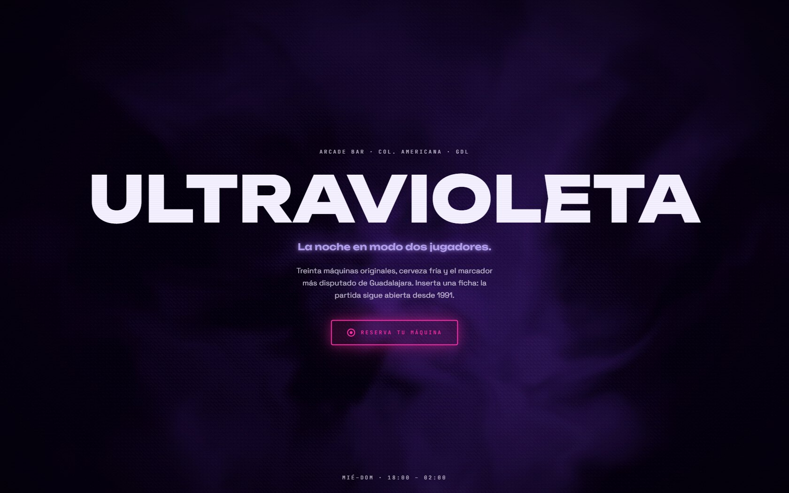
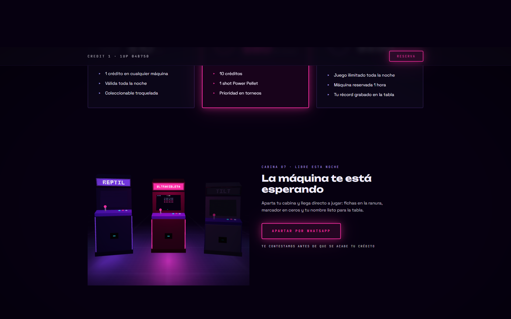

# ULTRAVIOLETA


Ver en vivo: https://angeljgc-dev.github.io/ultravioleta/

Landing de un arcade bar ficticio en la Colonia Americana. Es la primera página de la serie que construí con React, y a propósito no lleva ni una línea de GSAP: todo el movimiento sale de Motion, de shaders GLSL propios y de patrones del catálogo React Bits.

| Hero | Sección |
| --- | --- |
|  |  |

## Decisiones de diseño

Cada decisión de front (paleta, tipografía, transiciones, figuras) responde a la misma pregunta: ¿esto lo haría una máquina arcade? Si algo se sentía a plantilla de SaaS, lo rehacía.

- **Attract mode.** La primera visita abre con la pantalla de reposo de una cabina: `© 1991 ULTRAVIOLETA AMUSEMENTS`, `INSERT COIN` parpadeando en pasos duros (sin fade, porque el parpadeo arcade es binario) y `CREDIT 0` abajo a la izquierda. Cualquier tecla o clic inserta la ficha y un flash de 90 ms revela el sitio. Se salta sola a los 4 s, no se repite en la sesión y con `prefers-reduced-motion` ni aparece.
- El shader del hero cuantiza su salida a 22 niveles con un patrón Bayer 4×4, así deja de leerse como degradado de fintech y pasa a verse como fósforo ditherizado de monitor.
- Las scanlines dejaron el footer y ahora son una capa fija sobre toda la página, con viñeta en las esquinas.
- **Marcadores.** Los récords suben desde cero con ceros a la izquierda (`048,750`) y frenan como un contador mecánico; las iniciales del dueño parpadean como una entrada de tabla.
- Las máquinas se inclinan con `useSpring` (`rotateX/Y` ±6°, perspectiva 900) y el glare sigue al cursor.
- **Fichas troqueladas.** Cada plan de precios es una ficha SVG con canto dentado y la denominación grabada, con el badge `HIGH SCORE`. Las esquinas del sitio bajaron a `rounded-md`, para que todo se vea rectangular y biselado como un arcade.
- **Código Konami.** `↑↑↓↓←→←→BA` dispara un barrido de sincronía horizontal, el cartel `FREE PLAY MODE` glitcheado y 30 segundos de sala a más voltaje.
- **Reservar de verdad.** El CTA abre WhatsApp con el mensaje prellenado (día, hora, jugadores, nombre), que es el canal real de un negocio en Guadalajara, sin backend.
- **El marcador no se va.** Pasado el hero baja una barra fija con `CREDIT 1 · 1UP 048750` a la izquierda y el botón de reserva a la derecha. Me di cuenta tarde de que había ocho pantallas de scroll sin una sola ruta de reserva visible, y el sitio se leía como un folleto. La barra vive en `z-50`, por debajo de las scanlines, porque el HUD de un arcade va dentro de la pantalla, no encima. El crédito lee de `sessionStorage` la ficha que insertaste en el attract mode.

## Gráficos hechos a mano

Las dos piezas centrales no usan un solo asset externo.

El demo screen: detrás de Torneos corre una partida fantasma estilo *Galaxian*, la máquina que da nombre a la casa. Todos los sprites están dibujados como matrices en el código (nave, dos tipos de invasor con aleteo, explosión de cuatro cuadros) y una fuente pixel 3×5 propia pinta el HUD. El juego se juega solo: la nave patrulla, elige columna, apunta y dispara con cadencia lenta (~90 s por oleada); los invasores derivan en onda triangular con aleteo síncrono cada 600 ms. Corre en un backbuffer de 240×136 escalado con `image-rendering: pixelated`, con sprites pre-horneados a canvas (30 `drawImage` por cuadro en vez de ~1,200 `fillRect`), y el bucle solo vive mientras la sección está en viewport.

La sala: en Fichas hay un pasillo de cinco cabinas arcade modeladas con primitivas (cajas y cilindros con `flatShading`, palanca, tres botones, puerta de fichas con ranura cian), cada una con su marquesina, su altura y su estado; una está fuera de servicio y a dos les parpadea el tubo. La cámara entra al pasillo conforme bajas: arranca lejos, con las cinco en cuadro, y cierra sobre las tres centrales. Lee el `useScroll` de Motion con `MotionValue.get()` dentro del `useFrame`, así que no provoca un solo re-render de React por cuadro.

Toda la sala cuesta unas 8 draw calls y ~3,100 vértices. Las familias repetidas (mueble, panel, botones) van en `InstancedMesh`, las marquesinas comparten un atlas de textura y salen en un solo draw call, y el piso que parece reflejar está horneado en un canvas de 512² con `globalCompositeOperation: lighter`, así que en tiempo de render no cuesta nada. Solo la cabina central lleva textura viva: su pantalla reproduce la misma partida fantasma vía `CanvasTexture` del mismo backbuffer, el mismo motor alimentando las dos salidas.

Lo que más me costó fue el encuadre. El contenedor es casi cuadrado, y fijando el FOV por el eje vertical el ángulo horizontal se quedaba en unos 37°, con el pasillo cortado por los lados. Hay que fijarlo por el horizontal (54°) y despejar el vertical a partir del aspecto.

Un detalle que me costó rastrear: el timestamp del primer `requestAnimationFrame` puede ser anterior al `performance.now()` con el que arrancas el reloj. El primer `dt` sale negativo, y un módulo de JavaScript sobre un número negativo devuelve índice `-1`. Se arregla con clamp inferior a cero y módulo euclidiano.

## Animaciones

- **Seda violeta por shader.** El fondo del hero es un fragment shader con *domain warping* (fBm deformando fBm). Al principio corría sobre React Three Fiber, pero para pintar un solo triángulo a pantalla completa no hacía falta arrastrar three, así que lo reescribí en WebGL a pelo: el chunk pasó de 234 KB a 2.3 KB comprimidos y three salió del camino crítico (ahora solo lo carga la sala 3D, y cuando ya vas llegando a ella). El grano fino va inyectado en el shader para romper el banding de los gradientes oscuros.
- **Título descifrado.** El nombre de la marca se revela desde el centro con un scramble de dígitos hexadecimales y bloques de sombreado (`0123456789ABCDEF█▓▒░`), que es lo que enseñaría una ROM al arrancar. Empecé con caracteres griegos y se veía a película de hackers, no a máquina. El contenido real sigue siempre disponible en `sr-only`.
- El filtro por década reordena las tarjetas con animaciones `layout` de Motion y `AnimatePresence mode="popLayout"`, sin recalcular posiciones a mano.
- En el tríptico fotográfico cada columna deriva a velocidad distinta con `useScroll` + `useTransform` por elemento (parallax diferencial sin WebGL).
- Las sombras elevan con el color del elemento (tokens `--shadow-glow-*` en Tailwind v4), el patrón de los design systems futuristas.
- Chispas, cursor y marquee: click sparks en canvas, cursor gooey con estela (filtro SVG + interpolación exponencial en rAF) y cinta infinita con velocidad suavizada. La cinta no se detiene al pasar el cursor a propósito: la marquesina de un arcade no se para porque la mires.

## Transiciones de sección

Ninguna sección entra con el fade-up de siempre. Cada una es un cambio de pantalla distinto y el vocabulario vive aparte, en `src/componentes/transiciones/`.

- **Stage clear** en Las máquinas. Una rejilla de bloques se desintegra en diagonal con el easing cuantizado a 4 cuadros, para que el bloque salte en vez de interpolar. Es la sección más importante y por eso se lleva la transición más agresiva; si el wipe estuviera en las cinco dejaría de significar nada.
- **Ensamblado por sprites** en los títulos. Cada letra entra desde una posición cuantizada a 8 px con un resorte duro, y detrás va una estela que llega tarde y se apaga, el ghosting de sprite de una cabina de verdad.
- **Encendido CRT** en el tríptico. Punto, línea, imagen, con los tres tubos calentando en cascada. El `clip-path` tiene que terminar en `none` y no en `inset(0)`, o el contenedor recorta para siempre los glows que sobresalen.
- **Barrido de haz** en Torneos. Una línea cruza y deja el marcador impreso detrás. Los renglones ya no se animan por su cuenta, el escalonado lo hace el haz.
- **Slam de roster** en La barra y en Fichas. Las tarjetas llegan de frente y fuera de eje, como una pantalla de selección de personaje.

Con `prefers-reduced-motion` cada una hace early-return y deja el contenido plano. Aquí no se puede confiar en la configuración global: `MotionConfig reducedMotion="user"` corta transform y layout, pero deja pasar opacity y clip-path, que es justo el material del que están hechas estas transiciones.

El disparador es un `useInView` compartido, con una red de seguridad que puse después de romperlo: si el scroll salta de golpe (un ancla, o el navegador restaurando la posición al recargar) el observer puede no dispararse nunca y la sección se queda invisible para siempre. El hook comprueba también al montar si el elemento ya está dentro del viewport.

## Estructura

Una sola página en siete actos: hero → cinta arcade → las máquinas (bento filtrable) → la sala (tríptico) → la barra (cocteles neón) → torneos → fichas.

## Fallbacks y accesibilidad

| Condición | Qué pasa |
| --- | --- |
| `prefers-reduced-motion` | `<MotionConfig reducedMotion="user">` desactiva toda animación de transform (el kill-rule de CSS no alcanza a Motion, que anima por WAAPI); shader congelado, sin attract mode, sin scanlines, sin chispas. Verificado con muestreo por `rAF`: el transform salta de `y:36` a `none` sin un solo valor intermedio, y dos capturas separadas 1.4 s dan 0 píxeles de diferencia |
| Táctil | Sin hovers necesarios; todo accesible por tap |
| Hero fuera de viewport | Un `IntersectionObserver` cancela el `rAF` del shader, y `visibilitychange` hace lo mismo al cambiar de pestaña |
| Sin interacción | El `rAF` de las chispas no corre: arranca al primer clic y se detiene solo cuando no queda ninguna viva |

Contraste medido resolviendo el color real en canvas (Tailwind v4 emite `oklab`, que la mayoría de auditores parsea mal) y compositando sobre `#060010`: el texto informativo pasó de 2.83-3.41 a 5.70-6.65, y las listas a 11.61, todo por encima del 4.5:1 de WCAG AA. Los filtros de década usan `aria-pressed` (antes prometían un patrón de pestañas con teclado que no existía) y el foco tiene anillo cian propio en vez del outline fino del navegador.

## Cómo correr

```bash
npm install
npm run dev
```

Build estático listo para Pages: `npm run build` → `dist/` (base relativa).

## Licencia

Código bajo licencia [MIT](LICENSE). ULTRAVIOLETA es una marca inventada solo para este trabajo de portafolio; cualquier parecido con un negocio real es coincidencia. Los recursos de terceros mantienen la licencia de sus autores (ver Créditos).

## Créditos

Fotografía: [Pexels](https://www.pexels.com). Componentes de texto descifrado, glitch, chispas, cursor y marquee adaptados de [React Bits](https://reactbits.dev) © David Haz, MIT License. Tipografías: Unbounded, Space Grotesk y JetBrains Mono vía Google Fonts.

---
Ángel Josué García Canteros · [github.com/angeljgc-dev](https://github.com/angeljgc-dev)
